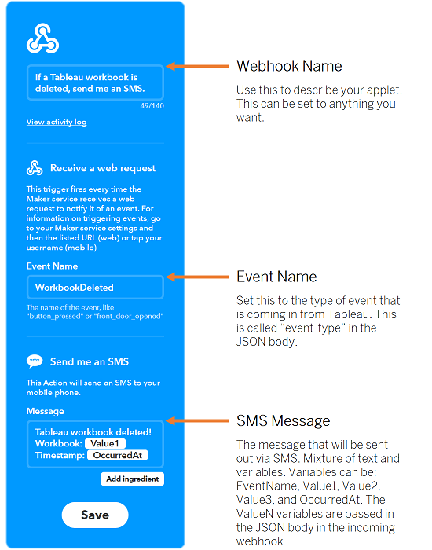

Tableau Webhooks IFTTT Broker
=================

This application expects webhooks from Tableau and then serves as a broker to IFTTT.

Set-up
------------
You will need an IFTTT account.

Once you are signed into IFTTT, visit [Webhooks Settings](https://ifttt.com/services/maker_webhooks/settings). Then you will need to copy the URL and set the `IFTTT_URL` variable to this value in the `.env` file.

You will also want to customize the webhook in IFTTT:


Usage
-----------
This app expects incoming POST messages on the /incoming endpoint. The body of the POST must be JSON. You need to customize the body of the message that will be sent to IFTTT as they expect the body to look like:
```
{
  "value1" = "yourdatahere",
  "value2" = "moreofyourdatahere",
  "value3" = "yetmoredata"
}
```
